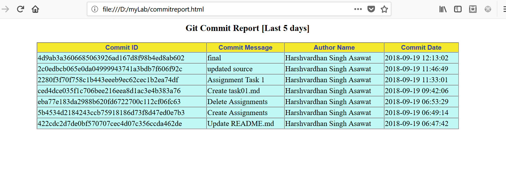

# Assignment 3

# Task 1: Read about the below topics

* sed (stream editor)
```
SED command in UNIX is stands for stream editor and it can perform lot’s of function on file like, searching, find and replace,   insertion or deletion. Though most common use of SED command in UNIX is for substitution or for find and replace. By using SED you can edit files even without opening it, which is much quicker way to find and replace something in file, than first opening that file in VI Editor and then changing it.

The basic usage is:

sed [options] commands [file-to-edit]

General syntax for sed −

/pattern/action

Some important Blogs:
https://www.digitalocean.com/community/tutorials/the-basics-of-using-the-sed-stream-editor-to-manipulate-text-in-linux
https://www.computerhope.com/unix/used.htm
https://www.tutorialspoint.com/unix/unix-regular-expressions.htm
https://www.tecmint.com/linux-sed-command-tips-tricks/
https://www.linuxtechi.com/20-sed-command-examples-linux-users/
```

* awk
```
Awk is a programming language which allows easy manipulation of structured data and the generation of formatted reports. Awk stands for the names of its authors “Aho, Weinberger, and Kernighan”
The Awk is mostly used for pattern scanning and processing. It searches one or more files to see if they contain lines that matches with the specified patterns and then perform associated actions.

Some of the key features of Awk are:

  - Awk views a text file as records and fields.
  - Like common programming language, Awk has variables, conditionals and loops
  - Awk has arithmetic and string operators.
  - Awk can generate formatted reports
  - Awk reads from a file or from its standard input, and outputs to its standard output. Awk does not get along with non-text files.

Awk Blog:
https://www.thegeekstuff.com/2010/01/awk-introduction-tutorial-7-awk-print-examples
https://www.cse.iitb.ac.in/~br/courses/cs699-autumn2013/refs/awk-tutorial.html
https://likegeeks.com/awk-command/
```

* shebang
```
The shebang is a special character sequence "#!" located at the top of many script file that specifies which program should be called to run the script. The shebang is always on the first line of the file, and is composed of the characters #! followed by the path to the interpreter program. 
 For example, in a shell script, the complete line may look similar to the following:
 #!/bin/bash

The #! syntax used in scripts to indicate an interpreter for execution of script under UNIX / Linux operating systems.
```

* exit status
```
Each Linux command returns a status when it terminates normally or abnormally. You can use command exit status in the shell script to display an error message or take some sort of action.

Exit codes are a number between 0 and 255, which is returned by any Unix command when it returns control to its parent process.
Other numbers can be used, but these are treated modulo 256, so exit -10 is equivalent to exit 246, and exit 257 is equivalent to exit 1.
These can be used within a shell script to change the flow of execution depending on the success or failure of commands executed.
Success is traditionally represented with exit 0; failure is normally indicated with a non-zero exit-code.

check exit status of command using echo $?
```

# Task 2:
* Make a script and pass 5 command line arguments(arguments value should be interger)

    - print 1st and 5th command line arguments
    -  print "INDIA" if 2nd argument equal to 10 else it will print "india"
    - print addition of all arguments
```
#!/bin/bash

#Make a script and pass 5 command line arguments

USAGE="USAGE: Please provide 5 arguments to run the script, e.g: scritname arg1 agr2 ... arg5"

if [ $# -eq 0 -o $# -lt 5 ]; then
        echo "$USAGE"
        exit 1
else
        echo -e "First argument=$1 \nFifth argument=$5"
        if [ $2 -eq 10 ]
        then
                echo "INDIA"
        else
                echo "india"
        fi
# whitespace for expr is important
        sum=`expr $1 + $2 + $3 + $4 + $5`
        echo -e "Addition of all 5 args is $sum"
fi
```

# Task 3:
* Make a script and pass one command line arguments(use loop)

    - print the table of command line argument if value is less 10
    - print 5 times "INDIA" if value is greater than or equal to 10
```
#!/bin/bash

#Make a script and pass one command line arguments(use loop)
USAGE="USAGE: Please provide an integer argument"

read -p "please input a number : " num

if ! [[ "$num" =~ ^[0-9]+$ ]]
    then
        echo $USAGE
        exit 1
fi
if [ $num -lt 10 ]
        then
                for i in {1..10}
                do
                echo "$num X $i = $(expr $num '*' $i)"

                done

elif [ $num -ge 10 ]
        then

        for i in {1..5}
        do
                echo "INDIA"
        done
fi
```

# Task 4:
* Make a script and print your name 10 times(use fuction to print your name)
```
#!/bin/bash

#Make a script and print your name 10 times(use fuction to print your name)

print_name() {

for i in {1..10}
do
        echo "Your Name Is $1 !!"
done
}

read -p "Enter your name : " name
print_name $name
```

* Make a excel sheet manually with 5 column, and print the 1st,3rd and 5th column
```
$ head -n 10 excel.csv
OrderDate,Region,Rep,Item,Units
1/6/16,East,Jones,Pencil,95
1/23/16,Central,Kivell,Binder,50
2/9/16,Central,Jardine,Pencil,36
2/26/16,Central,Gill,Pen,27
3/15/16,West,Sorvino,Pencil,56
4/1/16,East,Jones,Binder,60
4/18/16,Central,Andrews,Pencil,75
5/5/16,Central,Jardine,Pencil,90
5/22/16,West,Thompson,Pencil,32

$ cat excel.csv |awk -F, '{print $1"\t" $3"\t" $5}'
OrderDate       Rep     Units
1/6/16  Jones   95
1/23/16 Kivell  50
2/9/16  Jardine 36
2/26/16 Gill    27
3/15/16 Sorvino 56
4/1/16  Jones   60
4/18/16 Andrews 75
5/5/16  Jardine 90
```
# Task 5:
* Install the zabbix-agent using shell script
```
rpm -Uvh http://repo.zabbix.com/zabbix/3.0/rhel/7/x86_64/zabbix-release-3.0-1.el7.noarch.rpm
    if [ $? -ne 0 ]
         then
             echo "Unable to install zabbix agent on server."
             exit 1
    else
        echo "Installing zabbix agent";
        yum install zabbix-agent -y
        chkconfig zabbix-agent on
        cp
        sed -i 's/Server=127.0.0.1/Server=zabbix.opstree.com/' /etc/zabbix/zabbix_agentd.conf
        sed -i 's/Hostname=Zabbix/Hostname=192.168.1.57- zabbixagent/' /etc/zabbix/zabbix_agentd.conf
        if [ `echo $?` == 0 ]
                then
                echo "Starting the zabbix agent"
                service zabbix-agent start
        fi
    fi
```
#  Task 6:
* Make a script in which you will pass a git repo path and it will generate a html report of last 5 days commits. html report should contain
    - Commit Message
    - Commit ID
    - Author Name
    - Commit Date

```
#!/bin/bash

# Print html report for last 5 days commit
reportFile=commitreport.html

#Generate Report

gen_report() {
>$reportFile
cat  << 'EOF' > $reportFile
<html>
<body>
<h3 align="center">Git Commit Report [Last 5 days]</h3>
<table align="center" border="1" cellpadding="1" cellspacing="0" width="900" bgcolor="#BFF8F5">
 <thead>
   <tr style="color: #2F3FA5; font-family: Arial, sans-serif; font-size: 14px;" bgcolor="#F5E92E">
      <th>Commit ID</th>
      <th>Commit Message</th>
      <th>Author Name</th>
      <th>Commit Date</th>
    </tr>
 </thead>
 <tbody>
EOF

while read line
do
        echo "<tr><td>${line//,/</td><td>}</td></tr>" >> $reportFile
done < /tmp/input.csv
echo "</tbody></table></body></html>" >> $reportFile
rm -rf /tmp/input.csv
}

#fetch data
fetch_data() {
read -p "Please provide the abolute path for repo: " repo_path
#echo $repo_path
pushd $repo_path
git log --since=5.days --date=format:'%Y-%m-%d %H:%M:%S' --pretty=format:"%H,%s,%aN,%cd" >/tmp/input.csv
popd
}

#main
echo "===This script will generate the HTML report for last 5 days commit log.=="
fetch_data
if [ $? -eq 0 ]
then
        gen_report
else
        echo "Unable to generate report !!"
        exit 1
fi
```
* output


